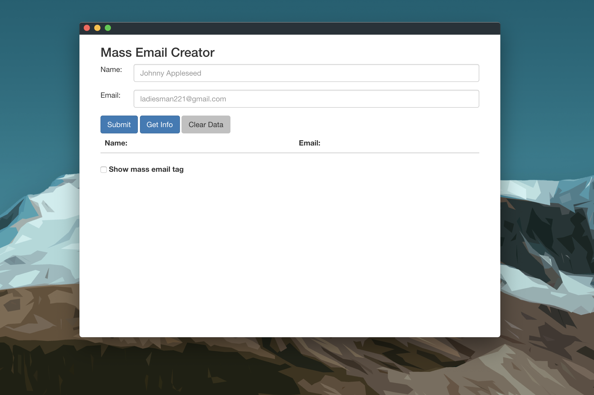

# Mass Email Creator
#
This is a simple native desktop application that allows the user to add contacts and their emails into a mass email chain that can later be used to send mass emails neatly. 
# 
Contact data is stored between use. 
#
## Install
Simply clone the project and download the dependencies with "npm install". Then run with "npm start".
#
# 
